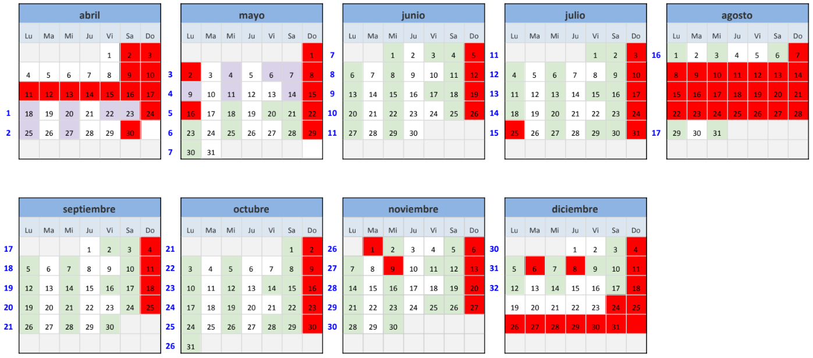

# Data Science core @ The Bridge School
> Part time edition

Forked from: https://github.com/MNievas12/core_DS_TheBridge  
and adapted to the Part time edition.

Schedule
--------------------------

Structure of the course:
------------------------  

### RAMP UP
3 weeks 

* 2022/04/18 - Presentation and Git
* 2022/04/20 - Markdown and Python basics I
* 2022/04/22 - Python basics I
* 2022/04/23 - Python basics II
* 2022/04/25 - Python basics III
* 2022/04/27 - Flow controls I
* 2022/05/04 - Flow controls II
* 2022/05/06 - Collections
* 2022/05/07 - Functions I
* 2022/05/09 - Functions II
* 2022/05/11 - Object Oriented Programming (OOP)
* 2022/05/14 - Python utils and final exercise

### DATA ANALYSIS
X weeks

### MACHINE LEARNING
X weeks 

### DATA SCIENCE & BUSINESS
X weeks